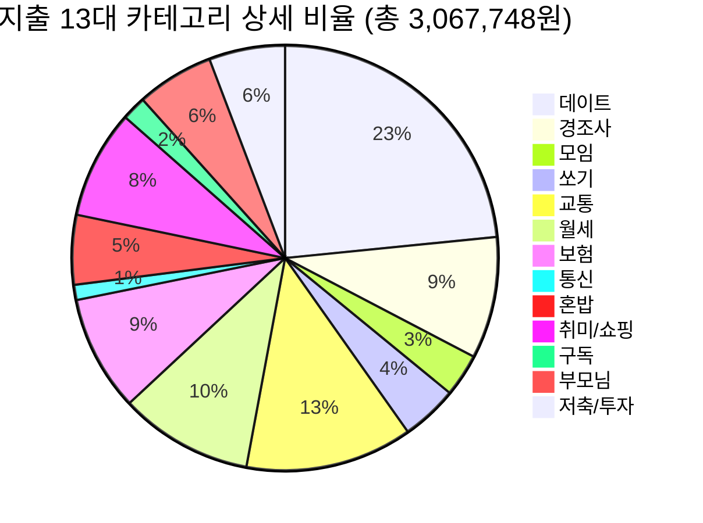

# 💸 내 월급 330만 원, 세밀한 13대 지출 항목 분해

고객님의 요청에 따라 지출 카테고리를 13가지로 더욱 잘게 쪼개어, **정확히 어느 항목에서 돈이 가장 많이 새고 있는지** 현미경처럼 들여다보았습니다.
*(조영자 식당 결제건 쏘기로 이동 완료)*
*(수리비 제외, 교정 사안 모두 적용된 찐 평균 지출액: 3,067,748원)*

## 🔍 13대 카테고리 상세 순위 및 내역

### 1위. 데이트: **718,300원** (23.4%)
* **주요 내역:** 은비와 외식 (85,000원), 은비와 외식 (55,000원), 은비와 여행 외식 (43,000원), 은비와 외식 (70,000원), 은비와 친구커플과 외식 (147,000원) 등...
### 2위. 교통: **389,400원** (12.7%)
* **주요 내역:** 주유 (60,000원), 주유 (60,000원), 주유 (60,000원), 주유 (60,000원), 택시 (11,200원) 등...
### 3위. 월세: **310,830원** (10.1%)
* **주요 내역:** 전기세 (10,830원), 월세 (300,000원)
### 4위. 경조사: **284,100원** (9.3%)
* **주요 내역:** 기부 (50,000원), 기부2 (5,000원), 결혼 축의금 (100,000원), 친구 생일 (100,000원), 지인 생일 (29,100원)
### 5위. 보험: **269,470원** (8.8%)
* **주요 내역:** DB보험 (53,560원), 흥국보험 (151,480원), 삼성보험 (54,430원), 운전자보험 (10,000원)
### 6위. 취미/쇼핑: **252,710원** (8.2%)
* **주요 내역:** 군산 외식 (23,000원), 모닝 커피 (37,000원), 모닝 커피 (3,700원), 친구들과 간식 (8,900원), 모닝 커피 (4,700원) 등...
### 7위. 부모님: **180,000원** (5.9%)
* **주요 내역:** 부모님 (주 1회 제한) (180,000원)
### 8위. 저축/투자: **177,126원** (5.8%)
* **주요 내역:** 청약 저축 (50,000원), 엔비디아 투자 (6,890원), 엔비디아 투자 (6,846원), 엔비디아 투자 (6,615원), 엔비디아 투자 (6,687원) 등...
### 9위. 혼밥: **162,310원** (5.3%)
* **주요 내역:** 모닝커피 (3,700원), 모닝커피 (3,700원), 모닝커피 (3,700원), 혼자 군것질 (22,300원), 쿠팡에서 과자 (25,190원) 등...
### 10위. 쏘기: **131,500원** (4.3%)
* **주요 내역:** 충북대 식사 쏘기 (20,000원), 군산 식사 쏘기 (34,000원), 커피 쏘기 (7,500원), 커피 쏘기 (5,000원), 커피 쏘기 (4,800원) 등...
### 11위. 모임: **100,000원** (3.3%)
* **주요 내역:** 친구 모임비 (50,000원), 남매 모임비 (50,000원)
### 12위. 구독: **56,752원** (1.8%)
* **주요 내역:** 유튜브 (14,900원), Zoom (28,264원), GitHub (6,088원), 구독료 (AI 다운그레이드) (7,500원)
### 13위. 통신: **35,250원** (1.1%)
* **주요 내역:** 통신비 (요금제 하향) (35,250원)

---
## 💡 상세 분해 결과 팩트 체크

이렇게 13가지로 나누어 보니, 고객님의 소비 패턴에서 **'통제 불가능한 고정비'**와 **'충분히 줄일 수 있는 변동비'**가 더욱 선명하게 구분됩니다.

**🚨 당장 칼을 대야 할 4대 악성(?) 변동비 (총 약 116만 원!)**
1. **데이트 (약 25%):** 가장 압도적입니다. 숙박을 줄이긴 어렵다면 무조건 식비와 카페 비중을 줄여야 합니다.
2. **경조사/선물 (약 9%):** 달마다 다르겠지만, 친구 생일에 크게 지출하거나 기부하는 비용은 대출 상환 시기에는 조금 타협이 필요합니다.
3. **쏘기 (약 4~5%):** 조영자 음식점을 포함해 충북대 지인 등에게 밥이나 커피를 쏘는 비용이 생각보다 누적되고 있습니다. "내가 살게"를 자제하셔야 합니다!
4. **취미/쇼핑/혼밥 (약 6%):** 혼자 쓰는 군것질, 모닝커피, 옷 충동구매, 피씨방, 노래방 등 혼자 푸는 스트레스 비용입니다.

이 4가지 카테고리만 합쳐도 **116만 원**이 훌쩍 넘습니다. 월세, 통신, 보험, 교통비 같은 고정성 지출을 빼고 나면, 사실상 고객님이 통제하실 수 있는 모든 낭비 여력은 저 4가지 항목에 다 몰려 있습니다! 여기서 절반만 줄여도 아파트 대금을 갚을 여력이 수십만 원이나 생깁니다.
