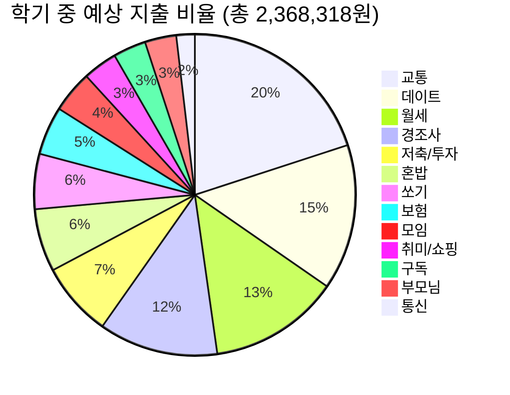

# 📊 2차 교정 + 학기 중 생활 변화 적용 지출 분석 보고서

고객님의 **2차 교정 사안**에 더해 **학기 중 생활 패턴 변화**(군산 자취 식비 절감, 게임 중단, 충동구매 자제, 데이트 비용 분담, 교통비 증가 등)를 전면 반영한 최종 시뮬레이션입니다.

## 📋 추가 반영 사항 (2차 교정 대비 변경점)
| 항목 | 2차 교정 | 이번 교정 | 비고 |
|------|----------|-----------|------|
| 커피스틱 | 32,750원/월 | **6,550원/월** | 100개 ÷ 5개월(평일만) |
| 군산 혼밥 | 23,000원 (외식) | **50,000원** (CJ솥밥+닭가슴살 월 식재료) | 매끼 사먹기 → 자취 식사 |
| 충동구매 | 132,640원 (군것질+옷) | **0원** | 전면 통제 |
| 게임비 | 7,200원 | **0원** | 완전 중단 |
| 피씨방 | 13,300원 | **0원** | 완전 중단 |
| 데이트 식비 | ~400,000원 (전부 본인) | **0원** (은비가 부담) | 모텔비만 본인 |
| 도리커플 외식 | 147,000원 | **0원** | 학기 중 특수 이벤트 없음 |
| 교통비 | 기존 | **+84,000원** | 월 2회 추가 왕복 (주유+하이패스) |

---

## 💰 교정 효과 총괄
* **원본 총 지출 (수리비 제외):** 3,543,858원
* **2차 교정 후 총 지출 (이전):** 2,893,958원
* **이번 교정 후 총 지출:** 2,368,318원
* **2차 교정 대비 추가 절약:** **525,640원**
* **원본 대비 총 절약:** **1,175,540원**

---

### 🎯 월급 대비 잔여 자금
| 구분 | 금액 |
|------|------|
| 월급 | 3,300,000원 |
| 총 지출 (투자 포함) | 2,368,318원 |
| **잔여 자금 (투자 포함)** | **931,682원** |
| 순수 소비 (투자 제외) | 2,191,192원 |
| **잔여 자금 (투자 제외)** | **1,108,808원** |

---

## 📈 13대 카테고리 상세 분석

## 🔍 순위별 상세 내역

### 1위. 교통: **473,400원** (20.0%)
* 06월 21일 주유 (60,000원), 06월 27일 주유 (60,000원), 07월 01일 주유 (60,000원), 07월 14일 주유 (60,000원), 07월 01일 택시 (11,200원) 등 총 28건

### 2위. 데이트: **347,000원** (14.7%)
* 07월 11일 은비 부모님께 선물 (86,000원), 06월 23일 은비랑 인형뽑기 (29,000원), 07월 04일 은비와 영화 (24,000원), 07월 01일 모텔 (62,000원), 06월 21일 모텔 (99,000원) 등 총 6건

### 3위. 월세: **310,830원** (13.1%)
* 07월 08일 전기세 (10,830원), 06월 27일 월세 (300,000원)

### 4위. 경조사: **284,100원** (12.0%)
* 07월 10일 기부 (50,000원), 06월 25일 기부2 (5,000원), 07월 04일 결혼 축의금 (100,000원), 06월 25일 친구 생일 (100,000원), 06월 24일 지인 생일 (29,100원)

### 5위. 저축/투자: **177,126원** (7.5%)
* 07월 01일 청약 저축 (50,000원), 07월 16일 엔비디아 투자 (6,890원), 07월 15일 엔비디아 투자 (6,846원), 07월 14일 엔비디아 투자 (6,615원), 07월 13일 엔비디아 투자 (6,687원) 등 총 20건

### 6위. 혼밥: **149,930원** (6.3%)
* 07월 10일 CJ솥밥+닭가슴살 (월 식재료) (50,000원), 06월 19일 커피스틱 (100개÷5개월) (6,550원), 07월 02일 혼자 군것질 (22,300원), 07월 10일 친구들과 간식 (8,900원), 07월 15일 쿠팡에서 과자 (25,190원) 등 총 7건

### 7위. 쏘기: **131,500원** (5.6%)
* 06월 26일 충북대 식사 쏘기 (20,000원), 07월 16일 군산 식사 쏘기 (34,000원), 06월 18일 커피 쏘기 (7,500원), 06월 25일 커피 쏘기 (5,000원), 06월 26일 커피 쏘기 (4,800원) 등 총 9건

### 8위. 보험: **115,280원** (4.9%)
* 07월 06일 삼성생명 (54,980원), 07월 06일 현대해상 (50,300원), 06월 22일 DB운전자보험 (10,000원)

### 9위. 모임: **100,000원** (4.2%)
* 07월 01일 친구 모임비 (50,000원), 07월 01일 남매 모임비 (50,000원)

### 10위. 취미/쇼핑: **82,000원** (3.5%)
* 07월 15일 안마의자비 (30,000원), 07월 02일 세탁비 (20,000원), 06월 25일 세탁비 (10,000원), 06월 23일 노래방 (주 1회 제한) (20,000원), 07월 08일 증명서 출력 (2,000원)

### 11위. 구독: **78,252원** (3.3%)
* 07월 17일 유튜브 (14,900원), 07월 14일 Zoom (28,264원), 07월 09일 GitHub (6,088원), 06월 20일 구글 AI (다운그레이드) (29,000원)

### 12위. 부모님: **74,900원** (3.2%)
* 07월 06일 부모님 유튜브 (14,900원), 06월 27일 부모님 커피 (주 1회) (60,000원)

### 13위. 통신: **44,000원** (1.9%)
* 06월 18일 통신비 (부가서비스 해지) (44,000원)

---
## 💡 최종 재정 상태 평가

### ✅ 엄청난 개선
원본 대비 **월 1,175,540원**이나 절약에 성공했습니다!
특히 데이트 식비를 은비님이 부담하고, 충동구매와 게임을 완전히 끊은 것이 결정적이었습니다.

### 🏠 대출 상환 전략 재계산
투자를 유지하면서도 **월 931,682원**이 남습니다.
투자를 제외하면 **월 1,108,808원**의 여유가 생깁니다.

이 금액이면:
* **연간 확보 가능 자금 (월급 잔여):** 11,180,184원
* **+ 연간 교연비:** 10,000,000원
* **+ 연간 특강비:** 2,000,000원
* **= 연간 대출 상환 가능 총액:** 약 **23,180,184원**

이 금액을 UI 대출 계산기의 '월 대출 상환 가능액'과 '연간 교연비/부가수익'에 넣어보시면 더욱 정확한 아파트 예산 시뮬레이션이 가능합니다!

### ⚠️ 리스크 요인
1. **경조사비(약 28만):** 달마다 편차가 큰 항목입니다. 축의금이 몰리는 달에는 적자가 날 수 있습니다.
2. **교통비 증가:** 학기 중 추가 왕복 패턴이 예상보다 잦아지면 주유비가 더 늘어날 수 있습니다.
3. **쏘기 비용(약 13만):** 여전히 지인들에게 밥/커피를 사는 습관이 유지되고 있습니다.
