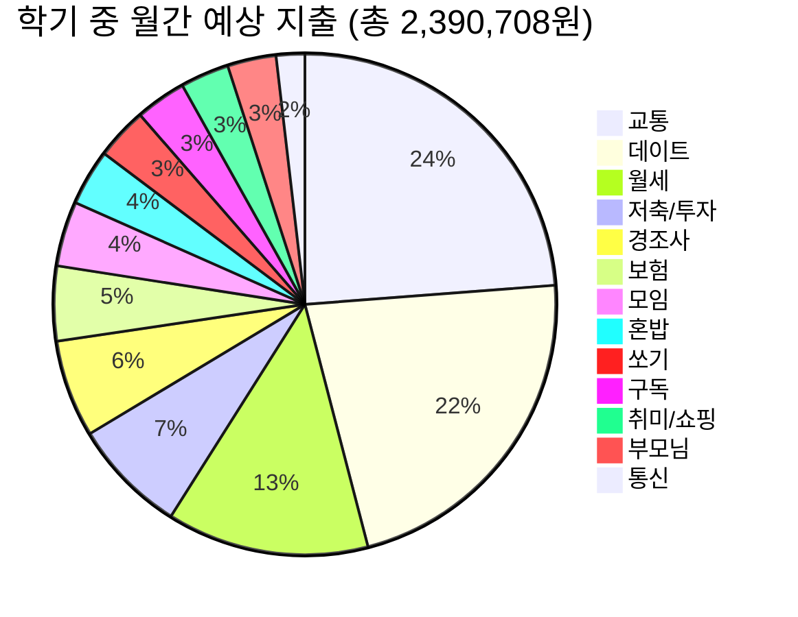

# 📋 학기 중 예상 월간 지출 보고서

고객님의 모든 교정 사안과 학기 중 생활 패턴을 **현실적으로** 반영한 예산안입니다.

> **핵심 수정 사항 (이전 대비)**
> - 모텔비: 월 2회 → **월 5회** (매주 토요일 기본)
> - 여행비: 미반영 → **월 1회 반영** (숙박+α, 식비는 은비 부담)
> - 교통비: 기존 대비 **1.75배 증가** (청주-군산 왕복 빈도 증가)
> - 주차비: **0원** (외부 무료 주차)
> - 세차: 11,000원 → **3,000원** (손세차)
> - 모임비: 친구+남매 **2건 고정** (100,000원)

---

## 💰 월간 예산 총괄

| 구분 | 금액 |
|------|------|
| 월급 | 3,300,000원 |
| **예상 총 지출** | **2,390,708원** |
| 순수 소비 (투자 제외) | 2,213,582원 |
| **잔여 자금 (투자 포함)** | **909,292원** |
| **잔여 자금 (투자 제외)** | **1,086,418원** |

---

## 📈 13대 카테고리 비율

---

## 🔍 카테고리 순위 및 상세 내역

### 1위. 교통: **568,600원** (23.8%)
> 🚗 장거리 통학 빈도 증가로 1위 등극. 줄이기 가장 어려운 고정성 변동비입니다.

### 2위. 데이트: **530,000원** (22.2%)
> 💕 모텔비(월 5회)가 압도적. 여행까지 포함하면 데이트 = 제2의 월세입니다.

### 3위. 월세: **311,000원** (13.0%)
> 🏠 숨만 쉬어도 나가는 돈. 건드릴 수 없는 성역.

### 4위. 저축/투자: **177,126원** (7.4%)
> 📈 매일 꾸준히 넣는 엔비디아 + 청약. 현 상태에선 유지 가능.

### 5위. 경조사: **150,000원** (6.3%)
> 🎁 달마다 편차가 가장 큰 항목. 결혼 시즌엔 50만 원까지 치솟을 수 있음.

### 6위. 보험: **115,280원** (4.8%)
> 🛡️ 리모델링 완료. 더 이상 줄이기 어려움.

### 7위. 모임: **100,000원** (4.2%)
> 🤝 친구 모임 + 남매 모임 2건 고정.

### 8위. 혼밥: **86,550원** (3.6%)
> 🍚 CJ솥밥+닭가슴살+간식. 사먹기 대비 대폭 절감.

### 9위. 쏘기: **80,000원** (3.3%)
> ☕ 지인에게 쏘는 비용. "나 요새 거렁뱅이야" 반복 훈련 필요.

### 10위. 구독: **78,252원** (3.3%)
> 💻 업무/학습 필수 도구들. AI 다운그레이드 완료.

### 11위. 취미/쇼핑: **75,000원** (3.1%)
> 🎤 노래방+세탁+미용+잡비. 생활 최소한.

### 12위. 부모님: **74,900원** (3.1%)
> 👨‍👩‍👦 커피만 사드리기 + 유튜브 구독. 효도의 최소 단위.

### 13위. 통신: **44,000원** (1.8%)
> 📱 부가서비스 해지 후 최적화 완료.

---

## 📝 항목별 상세 예산표

### 고정 지출 (소계: 740,558원)
| 항목 | 금액 | 비고 |
|------|------|------|
| 월세 | 300,000원 | 군산 자취방 |
| 전기세 | 11,000원 | 약 1만 원대 |
| 통신비 | 44,000원 | 부가서비스 해지 후 |
| 보험료 (삼성생명) | 54,980원 | 리모델링 후 |
| 보험료 (현대해상) | 50,300원 | 리모델링 후 |
| 보험료 (DB운전자) | 10,000원 | 유지 |
| 유튜브 (본인) | 14,900원 |  |
| 유튜브 (부모님) | 14,900원 | 부모님 계정 |
| Zoom | 28,264원 | 업무용 |
| GitHub | 6,088원 | 업무용 |
| 구글 AI | 29,000원 | 다운그레이드 |
| 청약 저축 | 50,000원 | 매월 고정 |
| 엔비디아 일일투자 | 127,126원 | 매일 약 6,700원 × 19일 |

### 변동 지출 (통제됨) (소계: 156,550원)
| 항목 | 금액 | 비고 |
|------|------|------|
| 부모님 커피 (주1회) | 60,000원 | 식사는 얻어먹기, 커피만 사드림 |
| 커피스틱 (월 분할) | 6,550원 | 32,750원 ÷ 5개월 |
| 노래방 (주1회) | 20,000원 | 5,000원 × 4주 |
| 군산 자취식비 (CJ솥밥+닭가슴살) | 50,000원 | 월 식재료 일괄 구매 |
| 세탁비 | 20,000원 | 월 1~2회 |

### 데이트 (학기 중) (소계: 530,000원)
| 항목 | 금액 | 비고 |
|------|------|------|
| 모텔비 (본인 부담, 월 5회) | 350,000원 | 매주 토요일 기본 + α, 약 70,000원 × 5회 |
| 여행 (월 1회) | 150,000원 | 숙박+α. 식비는 은비가 부담 |
| 은비 영화/여가 | 30,000원 | 월 1~2회 가벼운 여가 |

### 교통 (학기 중, 1.75배) (소계: 568,600원)
| 항목 | 금액 | 비고 |
|------|------|------|
| 주유비 | 420,000원 | 기존 4회 → 약 7회 (1.75배 증가) |
| 하이패스 | 145,600원 | 왕복 빈도 1.75배 증가 반영 |
| 손세차 | 3,000원 | 셀프 손세차 전환 |

### 사회생활 (소계: 330,000원)
| 항목 | 금액 | 비고 |
|------|------|------|
| 경조사/기부 (평균) | 150,000원 | 달마다 편차 큼 |
| 모임비 (친구+남매) | 100,000원 | 2건 × 50,000원 |
| 쏘기 (커피/식사) | 80,000원 | 횟수 줄이기 노력 반영 |

### 개인 용돈 (소계: 65,000원)
| 항목 | 금액 | 비고 |
|------|------|------|
| 미용실 | 25,000원 | 월 1회 |
| 간식/군것질 (통제) | 30,000원 | 충동구매 자제 |
| 기타 잡비 | 10,000원 | 증명서 등 |

---

## 🏠 대출 상환 전략 시뮬레이션

### 월급에서의 확보 자금
| 시나리오 | 월 잔여 | × 12개월 | 연간 |
|----------|---------|----------|------|
| 투자 유지 | 909,292원 | × 12 | 10,911,504원 |
| 투자 중단 | 1,086,418원 | × 12 | 13,037,016원 |

### 연간 보너스 수입
| 항목 | 금액 |
|------|------|
| 교연비 | 10,000,000원 |
| 특강비 | 2,000,000원 |
| **소계** | **12,000,000원** |

### 연간 대출 상환 총 화력
| 시나리오 | 월급 잔여 | + 보너스 | **연간 합계** |
|----------|-----------|----------|---------------|
| 투자 유지 | 10,911,504원 | 12,000,000원 | **22,911,504원** |
| 투자 중단 | 13,037,016원 | 12,000,000원 | **25,037,016원** |

---

## ⚠️ 리스크 및 유의사항

1. **모텔비가 최대 변수:** 월 5회(35만)로 잡았으나, 여행 숙박까지 합치면 데이트 숙박비만 50만 원입니다. 데이트 비용이 "아꼈다"고 보기 어려운 이유입니다.
2. **교통비 상방 리스크:** 1.75배로 추정했으나, 2배까지 올라가면 주유+하이패스만 약 65만 원에 달합니다. (현재 추정: 약 57만 원)
3. **경조사 시즌:** 10~11월 결혼 시즌에는 축의금 2~3건이 몰릴 수 있어 일시적으로 50만 원까지 치솟을 수 있습니다.
4. **쏘기 비용 복귀:** 8만 원으로 잡았지만, 새 학기에 새로운 사람들을 만나면 자연스럽게 올라갈 수 있습니다.
5. **차량 돌발 비용:** 타이어 교체, 수리 등 연 1~2회 비정기 지출을 연간 30~50만 원 예비비로 염두에 두세요.
