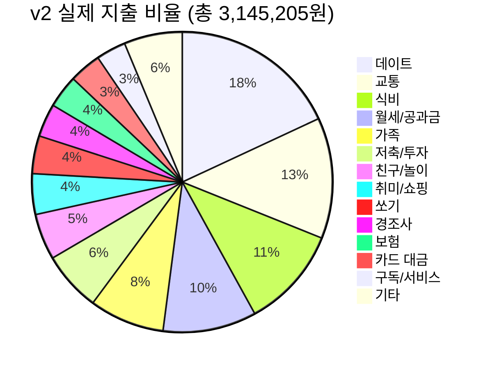

# 📊 Budget v2 지출 분석 보고서
**분석 기간:** 2026년 7월 29일 ~ 8월 28일 (약 1개월)

> [!IMPORTANT]
> **핵심 요약:** 돈 아끼기로 한 후에도 순 지출이 **3,145,205원**으로, v1에서 예측한 2,368,318원보다 **776,887원(+32.8%)** 초과 지출하였습니다.

---

## 💰 총괄 요약

| 구분 | 금액 |
|------|------|
| 총 지출 | 3,345,205원 |
| 수입 (엄마 용돈) | -200,000원 |
| **순 지출** | **3,145,205원** |
| v1 예측 지출 | 2,368,318원 |
| **초과 지출** | **+776,887원 (+32.8%)** |
| 월급 | 3,300,000원 |
| **잔여 자금** | **154,795원** |

> [!WARNING]
> 월급 3,300,000원 대비 순 지출이 3,145,205원으로, 잔여 자금이 **15만원** 수준입니다. 사실상 마이너스에 가까운 상황입니다.

---

## 📈 카테고리별 순위 (순 지출 3,145,205원 기준)

---

## 🔍 v1 예측 vs v2 실제 비교

| 카테고리 | v1 예측 | v2 실제 | 차이 | 평가 |
|----------|---------|---------|------|------|
| 데이트 | 347,000 | **586,100** | **+239,100** | ❌ 크게 초과 |
| 교통 | 473,400 | 422,500 | -50,900 | ✅ 절약 |
| 식비(혼밥) | 149,930 | **354,120** | **+204,190** | ❌ 크게 초과 |
| 월세/공과금 | 310,830 | 326,560 | +15,730 | ⚠️ 비슷 |
| 가족 | 74,900 | **262,200** | **+187,300** | ❌ 크게 초과 |
| 저축/투자 | 177,126 | 208,849 | +31,723 | ⬆️ 투자 증가 |
| 친구/놀이 | 0 (중단 약속) | **160,800** | **+160,800** | ❌ 약속 미이행 |
| 취미/쇼핑 | 82,000 | **142,100** | **+60,100** | ❌ 초과 |
| 쏘기 | 131,500 | 132,200 | +700 | ✅ 거의 동일 |
| 경조사 | 284,100 | 115,500 | -168,600 | ✅ 절약 |
| 보험 | 115,280 | 114,730 | -550 | ✅ 동일 |
| 구독/서비스 | 78,252 | **104,188** | **+25,936** | ⚠️ 소폭 초과 |
| 모임 | 100,000 | 100,000 | 0 | ✅ 동일 |
| 통신 | 44,000 | **66,310** | **+22,310** | ❌ 초과 |

---

## ❌ 초과 지출 주요 원인 분석

### 1. 데이트 비용: +239,100원 (예측 대비 +69%)
v1에서 **"은비가 식비 부담"**으로 계획했으나, 실제로는 본인이 대부분 부담했습니다.

**주요 지출:**
- 롯데월드 관련 총: **176,000원** (택시+야식+카페+놀이 등)
- 숙박비 총: **226,400원** (3회)
- 은비와 야식: **97,500원** (2회)

> [!NOTE]
> **데이트 식비 분담 약속이 지켜지지 않았고**, 롯데월드 같은 대형 이벤트 지출이 v1에서 전혀 예상되지 않았습니다.

### 2. 식비/생필품: +204,190원 (예측 대비 +136%)
v1에서 자취 식사(CJ솥밥)로 월 5만원을 계획했으나, 실제로는 **외식·편의점·생필품·장보기**가 대폭 증가했습니다.

**주요 지출:**
- 생필품 2건: 69,000원
- 계곡 장보기 2건: 49,300원
- 계곡 추가 숙소: 110,000원 (계곡 여행이 별도 이벤트)
- 외식: 36,000원
- 쿠팡 장보기: 30,740원

### 3. 가족 비용: +187,300원 (예측 대비 +250%)
v1에서 가족 항목은 "부모님 커피 + 유튜브"로 74,900원만 잡았으나, 실제로는 **가족 식사·카페**가 10회 발생하여 262,200원에 달했습니다.

### 4. 친구/놀이: +160,800원 (약속 미이행)
v1에서 게임·PC방을 **완전 중단**하기로 약속했으나, 실제로는:
- PC방/피씨방: 3회 21,400원
- 친구 식사/커피/PC방 쏘기: 139,400원 (8/16 하루에만 14만원!)

### 5. 벌금/카드대금/미분류 등 예상 외 항목: 약 340,000원
- 신호위반 벌금: 70,000원
- 농협 카드 대금: 111,848원
- 미분류(모름): 40,000원 (사용처 기억 안 남)

---

## 💡 v1 대비 잘 지킨 항목

| 항목 | 평가 |
|------|------|
| 교통비 | ✅ 예측보다 5만원 절약 (하이패스 최적화) |
| 경조사비 | ✅ 예측보다 17만원 절약 (이번 달 적었음) |
| 쏘기 | ✅ 거의 예측과 동일 |
| 보험 | ✅ 고정비 정확 |
| 모임 | ✅ 고정비 정확 |

---

## 🎯 개선 제안

### 즉시 실행 가능한 절약 항목
| 항목 | 현재 | 개선 방향 | 절약 예상 |
|------|------|-----------|-----------|
| 데이트 식비 분담 | 본인 전부 부담 | **실제로 분담 실행** | -150,000원 |
| PC방/게임 | 3회 21,400원 | **약속대로 중단** | -21,400원 |
| 충동적 외식 | 36,000원 | 자취 식사 강화 | -20,000원 |
| 통신비 | 66,310원 | 요금제 다운그레이드 확인 | -22,000원 |
| 쿠팡 취미 | 54,300원 | 충동구매 자제 | -54,300원 |
| 미분류(모름) | 40,000원 | 지출 즉시 기록 습관 | -40,000원 |
| **합계** | | | **약 -307,700원** |

> [!TIP]
> 위 항목만 실천해도 월 잔여 자금을 약 **46만원** 수준으로 끌어올릴 수 있습니다.

### ⚠️ 통제 불가 변수
- **가족 비용 (26만원):** 부모님·가족과의 식사는 줄이기 어렵습니다.
- **경조사비:** 매월 편차가 크므로 비상금 확보가 필요합니다.
- **벌금 (7만원):** 안전운전으로 원천 차단해야 합니다.

---

## 📌 결론

v1에서 절약 계획을 세웠지만, **실제 한 달을 살아보니 예측보다 약 78만원 초과 지출**했습니다. 주요 원인은 다음 3가지입니다:

1. **데이트 식비 분담이 실행되지 않음** (가장 큰 원인)
2. **가족 비용을 과소 평가** (실제로 가족과의 식사·카페가 잦음)
3. **게임/PC방 중단 약속 미이행**

현재 월급 대비 잔여 자금이 **15만원**에 불과하여 아파트 대출 상환 자금 확보에 큰 차질이 발생하고 있습니다. v1에서 예측한 "월 93만원 여유"와는 괴리가 매우 큽니다.
