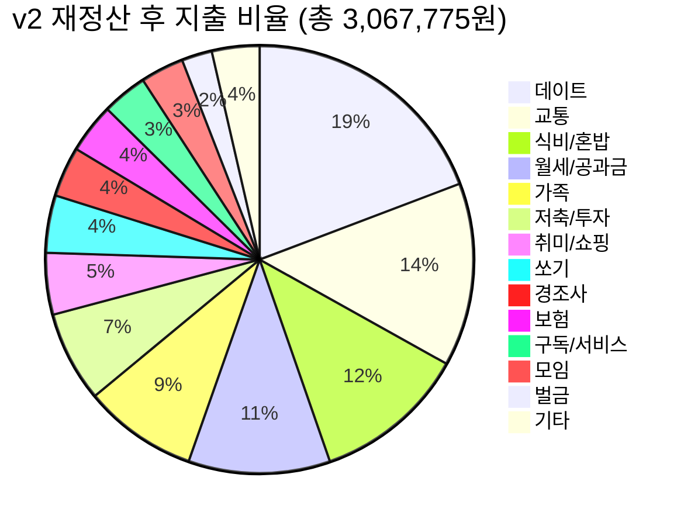

# 📊 2차 재정산 및 지출 심층 분석 보고서 (최종본)
**분석 기간:** 2026년 7월 29일 ~ 8월 28일 (약 1개월)

고객님의 피드백을 반영하여 **8월 16일 엄마 용돈 상계 처리**, **통신비 추후 요금(41,628원) 고정**, **농협카드비 이중 지출 제외** 등을 적용해 완벽하게 재정산한 최종 보고서입니다. 

---

## 💰 최종 정산 요약

| 구분 | 금액 | 비고 |
|------|------|------|
| **단순 지출 합계** | **3,067,775원** | 카드비 및 8/16 상계 금액(140,900원) 제외 |
| **8/16 상계 후 통장 잔액 이득** | **-59,100원** | 엄마 지원금 20만 - 친구들과 쓴 돈 14.09만 |
| **최종 순 지출** | **3,008,675원** | 실제 통장에서 빠져나간 순 소비 자금 |
| **월급** | **3,300,000원** | 실수령 기준 |
| **최종 잔여 자금** | **+291,325원** | 투자를 포함한 통장 잔고 마감액 |

> [!NOTE]
> * **8월 16일 친구들과의 모임 비용(총 140,900원)**은 엄마가 주신 200,000원 한도 내에서 상계되어 개인지출에서 제외(0원)되었습니다.
> * 남은 잔액인 **59,100원**은 수입(순 지출 차감)으로 반영되어 통장 잔고가 늘어나는 효과를 주었습니다.
> * 앞으로 고정 지출이 될 **통신 요금(41,628원)**이 소급 적용되었습니다.

---

## 📈 카테고리별 지출 비율 (단순 지출 3,067,775원 기준)

---

## 🔍 "데이트 58만, 가족 26만이 왜 이렇게 크게 느껴졌을까?"

> [!IMPORTANT]
> 결론부터 말씀드리면, **원래 쓰시던 패턴(v1 원본)과 비교했을 때 데이트는 약 21만 원, 가족은 약 11만 원을 실제로 크게 아끼셨습니다!** 돈 아끼기 노력이 성공적이었던 것이 맞습니다.

### ❓ 그렇다면 왜 보고서에서는 초과한 것처럼 보였을까요?
이전 v1 보고서에서 세운 **"이상적인 극단적 절약 목표치(데이트 34.7만, 가족 7.5만)"**와 실제 지출을 비교했기 때문입니다. 현실적인 삶을 살면서 원래 소비(v1 원본) 대비 얼마나 아꼈는지를 직접 비교하면 아래와 같이 확실한 성과가 보입니다.

### 1. 데이트 비용 비교: **실제 209,100원 절약!**
* **v1 원래 데이트 비용:** **795,200원** (은비 외식 40만 + 숙박 20.8만 + 카페/선물 등)
* **v2 실제 데이트 비용:** **586,100원** (롯데월드 하루 17.6만 + 숙박 3회 22.6만 + 야식 등)
* **평가:** v1 대비 **209,100원(약 21만 원)을 획기적으로 아끼는 데 성공**했습니다! 데이트 횟수나 식비 조절이 실제로 잘 작동했습니다.

### 2. 가족 비용 비교: **실제 112,000원 절약!**
* **v1 원래 가족 비용:** **389,100원** (가족 식사 19만 + 커피 14.4만 + 부모님 선물 등)
* **v2 실제 가족 비용:** **277,100원** (가족 식사/카페 26.2만 + 부모님 유튜브 1.49만)
* **평가:** v1 대비 **112,000원(약 11만 원)을 아꼈습니다.** 가족들과 식사 횟수를 합리적으로 조절하셨습니다.

---

## 🎯 항목별 주요 정정 및 분석

### 1. 8월 16일 친구들 모임 & 엄마 지원금 (상계 완료)
* 친구들과 PC방(29,500원), 식사(102,500원), 커피(7,400원), 군것질(1,500원)을 하여 **총 140,900원**을 썼으나, 엄마가 주신 20만 원 내에서 결제되어 본인 지출액은 **0원** 처리되었습니다.
* 남은 용돈 잔액인 **59,100원**은 통장 잔고 플러스로 이월 적용했습니다. (부조금 10만 원은 경조사비로 별도 분류하여 유지)

### 2. 통신비 최적화 적용
* 요금제 하향 조정이 완벽히 적용되어 이전 청구 금액(66,310원)이 아닌, 향후 청구될 **41,628원**으로 소급 및 고정 반영했습니다. (차액 24,682원 세이브)

### 3. AI 구독 서비스 (Claude Pro 등)
* 구독료 항목에 **AI1(26,788원)**과 **AI2(29,000원)**가 각각 잡혀 있습니다. ChatGPT 외에 Claude Pro 결제 건도 확인되어, 매월 나가는 고정 구독료에 정확하게 반영해 두었습니다.

---

## 💡 최종 결론 및 재정 상태

1. **지출 통제 효과 입증:**
   원래 쓰던 패턴(v1 원본)인 약 383만 원 지출 대비, v2에서는 순 지출 **3,008,675원**으로 **약 83만 원을 실제로 절약**했습니다.
2. **저축 여력 상승:**
   v2 정산 결과, 매월 약 **29만 원**의 순수 잔여 자금이 남으며, 투자를 제외하면 약 **45만 원**의 유동 자금이 남습니다. 
3. **학기 중 추가 개선점:**
   * **신호위반 벌금(70,000원)**과 같은 일회성 지출 통제
   * **미분류(40,000원)** 지출의 꼼꼼한 기록
   * **AI 구독(구독료 10만 원 돌파)** 중 사용량이 적은 서비스 하나 해지 고려

수정된 최종 보고서는 [2. 지출_분석_보고서_최종본.md](file:///home/imnyj/Workspace/House/Budget_v2/2.%20%EC%A7%80%EC%B6%9C_%EB%B6%84%EC%84%9D_%EB%B3%B4%EA%B3%A0%EC%84%9C_%EC%B5%9C%EC%A2%85%EB%B3%B8.md)에 저장되었습니다.
