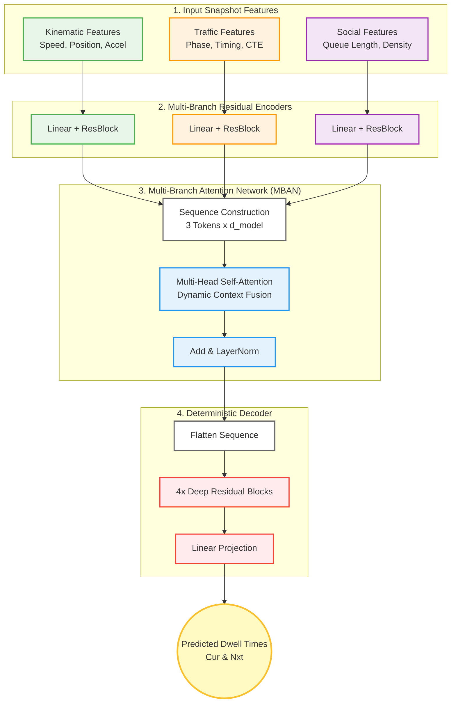

```mermaid
graph TD
    subgraph Inputs ["1. Input Snapshot Features"]
        K[Kinematic Features<br/>Speed, Position, Accel]
        T[Traffic Features<br/>Phase, Timing, CTE]
        S[Social Features<br/>Queue Length, Density]
    end

    subgraph Encoders ["2. Multi-Branch Residual Encoders"]
        RK[Linear + ResBlock]
        RT[Linear + ResBlock]
        RS[Linear + ResBlock]
    end

    subgraph MBAN ["3. Multi-Branch Attention Network (MBAN)"]
        Seq[Sequence Construction<br/>3 Tokens x d_model]
        MHA[Multi-Head Self-Attention<br/>Dynamic Context Fusion]
        Norm[Add & LayerNorm]
    end

    subgraph Decoder ["4. Deterministic Decoder"]
        Flatten[Flatten Sequence]
        ResDec[4x Deep Residual Blocks]
        MLP[Linear Projection]
    end

    Out((Predicted Dwell Times<br/>Cur & Nxt))

    K --> RK
    T --> RT
    S --> RS

    RK --> Seq
    RT --> Seq
    RS --> Seq

    Seq --> MHA
    MHA --> Norm
    
    Norm --> Flatten
    Flatten --> ResDec
    ResDec --> MLP
    MLP --> Out

    style K fill:#e8f5e9,stroke:#4caf50,stroke-width:2px
    style T fill:#fff3e0,stroke:#ff9800,stroke-width:2px
    style S fill:#f3e5f5,stroke:#9c27b0,stroke-width:2px
    
    style RK fill:#e8f5e9,stroke:#4caf50,stroke-width:2px
    style RT fill:#fff3e0,stroke:#ff9800,stroke-width:2px
    style RS fill:#f3e5f5,stroke:#9c27b0,stroke-width:2px

    style Seq fill:#ffffff,stroke:#666666,stroke-width:2px
    style MHA fill:#e3f2fd,stroke:#2196f3,stroke-width:2px
    style Norm fill:#e3f2fd,stroke:#2196f3,stroke-width:2px
    style Flatten fill:#ffffff,stroke:#666666,stroke-width:2px

    style ResDec fill:#ffebee,stroke:#f44336,stroke-width:2px
    style MLP fill:#ffebee,stroke:#f44336,stroke-width:2px

    style Out fill:#fff9c4,stroke:#fbc02d,stroke-width:3px
```
