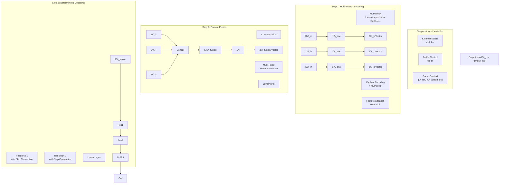

# Research Overview — ST-MBAN for CCVN V2I Precaching

> 통합 정리본
> - 원본 1: `Main Idea.md` (ST-MBAN 신규 설계)
> - 원본 2: `ST-CVAE 구조.md` (기존 baseline 모델 구조)
> 위치: `/home/imnyj/papers/paper1/paper/idea/research_overview.md`

## A. 연구 목표

CCVN(Content-Centric Vehicular Network) 환경에서 V2I Precaching의 타이밍을 결정하기 위해
**RSU 체류 시간(dwell time)을 차량별로 예측**한다. RSU가 자체 수집한 snapshot 데이터만으로
독립 학습하는 **RSU-Local 학습** 시나리오를 가정한다.

타깃 출판처: IEEE Internet of Things Journal (CIoV 관점 강조).

---

## B. 기존 모델: ST-CVAE (Last Paper, Baseline)

RSU(Roadside unit)는 신호등이 있는 교차로 한 가운데에 배치됨.

1. Input Data (X)
 - veh_id: 차량 ID
 - cur_rsu: 현 RSU ID
 - nxt_rsu: next RSU ID
 - r_cov: RSU 통신범위(반경 800m)
 - d_rsu: RSU 간의 거리(2400m, 음영지역 800m 발생)
 - direct: 차량이 RSU(신호등)로 향하는 방향이면 -1, 이미 신호등을 건너서 나가는 방향이면 1
 - n_t_0: 현 RSU의 통신범위 내에서 같은 next RSU로 향하는 차량 수
 - n_t_1: next RSU의 이웃1의 통신범위 내에서 next RSU로 향하는 차량 수
 - n_t_2: next RSU의 이웃2의 통신범위 내에서 next RSU로 향하는 차량 수
 - n_t_3: next RSU의 이웃3의 통신범위 내에서 next RSU로 향하는 차량 수
 - d_l_c: 차량이 현 RSU 통신범위 나갈때까지의 남은 거리
 - d_e_n: 차량이 next RSU의 통신범위 진입까지 남은 거리
 - d_l_n: 차량이 next RSU의 통신범위를 이탈할 때까지 남은 거리
 - v_c_a: 현 RSU에서의 차량들의 평균 속도 (1시간 내 Queue에 축적된 데이터로 통계)
 - v_n_a: next RSU에서의 차량들의 평균 속도 (1시간 내 Queue에 축적된 데이터로 통계)
 - tls_c: 현 RSU의 신호등 상태
 - tls_n: next RSU의 신호등 상태
 - tlt_c: 현 RSU의 신호등이 바뀔때까지 남은 시간
 - tlt_n: next RSU의 신호등이 바뀔때까지 남은 시간
 - n_cur: 현 RSU의 통신범위 내에 있는 차량 수
 - n_nxt: next RSU의 통신범위 내에 있는 차량 수

 * Cyclical encoding: 신호등 신호를 주기에 걸쳐 연속된 삼각함수 값으로 치환

2. Target Data (Y)
 - t_dwell: 요청 차량의 현 RSU 통신범위 이탈까지의 시간
 - t_ent_n: 요청 차량의 next RSU 통신범위 진입까지의 시간
 - t_lev_n: 요청 차량의 next RSU 통신범위 이탈까지의 시간

 3. Encoding
  * Training
   - [X, Y] 입력
   - Posterior: Linear-ResBlock-ResBlock-LayerNorm
   - 평균(mu_Psi)과 분산(sigma_Psi) 출력
   - Z* 도출
   
  * Inference
   - [X, Y] 입력
   - Prior: Linear-ResBlock-ResBlock-LayerNorm
   - 평균(mu_Phi)과 분산(sigma_Phi) 출력
   - Stochcstic sampling

 * KL-Divergence
  - mu_Psi, sigma_Psi, mu_Phi, sigma_Phi를 통하여 D_KL 도출

4. Dicoding
 * Decoder: Linear-ResBlock-ResBlock-ResBlock-Linear
  - input: Traning(X, Z*), Inference(Point prediction Z_mu, Stochastic sampling: Z_1~Z_N)
  - output: Dwell time distribution -> CQR -> Final Prediction

+ ResBlock: LayerNorm-Linear-ReGLU-Dropout-LayerNorm-Linear-ReGLU

---

## C. 신규 제안: ST-MBAN (Spatio-Temporal Multi-Branch Attention Network)

# 분산형 Snapshot 기반 Multi-Branch 예측 모델 설계

## 1\. 모델 개요

* **목적:** Content-Centric Vehicular Network에서 차량의 현 RSU 체류 위치 이탈 시간과 다음 RSU 진입 및 이탈 시간을 독립적으로 예측, 최적의 Chunk 단위 Precaching을 수행합니다.
* **접근 방식 (Snapshot 기반 독립 학습):** 특정 시점(Snapshot)의 전체/주변 차량 데이터를 바탕으로 각 RSU가 개별적으로 자체 학습 모델을 구동하여 통신 부하 감소.
* **구조 설계 (Multi-Branch Network):** 통합된 모델 아키텍처 대신, 입력 변수의 성질(분야)에 따라 카테고리를 나누고, 이를 각기 다른 최적화 모델 유닛(Block)에 통과시킨 뒤 Feature Fusion을 통해 최종 목표를 도출합니다.

\---

## 2\. 입력 변수 재정의 및 카테고리 분류 (Category)

입력 변수는 특성에 따라 3가지 주요 카테고리로 분류하여 분기 처리를 수행합니다. 하나의 변수는 특성에 따라 중복된 카테고리에 속하여 여러 Block의 입력으로 활용될 수 있습니다.

### 카테고리 정의

* **\[K] Kinematic (운동학적 특성)**

  * 차량의 물리적 위치, 이동 속도, 거리 등을 의미합니다.
  * **설계 아이디어:** MLP나 1D-CNN Block을 거쳐 특징 벡터를 추출합니다.
* **\[T] Traffic Control (교통 제어 특성)**

  * 주기적이고 제한적인 흐름을 유도하는 신호등 제약 요인 등을 의미합니다.
  * **설계 아이디어:** Cyclical Encoding 후 RNN 또는 단순 Linear Layer 계층으로 처리합니다.
* **\[S] Social / Contextual (주변 혼잡도 및 상호작용 특성)**

  * 주변 차량 분포, 대기열, 합류 구간 혼잡도 등 타 차량에 의한 직/간접적 소요 시간 증가를 의미합니다.
  * **설계 아이디어:** Graph Neural Networks(GNN), 혹은 Feature Attention 방식의 Block을 통해 타 차량이 주행에 미치는 가중치를 파악합니다.

\---

## 3\. 세부 입력 변수 (Input Variables, X)

### 기존 ST-CVAE 기반 변수

|변수명|설명|카테고리|
|-|-|-|
|`veh\\\_id`|차량 ID (모델 학습이 아닌 식별 용도)|-|
|`cur\\\_rsu`, `nxt\\\_rsu`|현 RSU 및 next RSU 식별자|\[S]|
|`r\\\_cov`, `d\\\_rsu`|RSU 통신범위 및 RSU 간 물리적 거리|\[K]|
|`direct`|향하는 방향 (-1 or 1)|\[K]|
|`n\\\_t\\\_0`, `n\\\_t\\\_1` \~ `3`|특정 범위 내 목표/이웃 RSU 방향 차량 수|\[S]|
|`d\\\_l\\\_c`, `d\\\_e\\\_n`, `d\\\_l\\\_n`|각각 남은 거리 및 다음 RSU 진입/이탈까지 거리|\[K]|
|`v\\\_c\\\_a`, `v\\\_n\\\_a`|현재/다음 RSU 통신범위 전체 차량들의 평균 통계 속도|\[K], \[S]|
|`tls\\\_c`, `tls\\\_n`|현재/다음 RSU 통신구간 신호등의 현재 상태|\[T]|
|`tlt\\\_c`, `tlt\\\_n`|현재/다음 RSU 구간 신호등의 변경까지 대기 시간|\[T]|
|`n\\\_cur`, `n\\\_nxt`|범위 내 총 차량 수 (절대 밀도)|\[S]|

### 신규 보강 변수 (SUMO 기반 Micro/Macro 지표)

|변수명|설명|카테고리|
|-|-|-|
|`n\\\_ahead\\\_cur`, `n\\\_ahead\\\_nxt`|주행 도로(Edge/Lane) 상 요청차 앞 차량 통계 수|\[S]|
|`v\\\_ahead\\\_avg`|막혀있는 전방 차들의 평균 속도|\[K], \[S]|
|`dist\\\_leader`|선행 차량(Leader)과의 상대 거리|\[K]|
|`v\\\_leader`|선행 차량(Leader)의 현재 주행 속도|\[K]|
|`q\\\_len\\\_cur`, `q\\\_len\\\_nxt`|다음 교차로 진입 대기열(Halting Vehicles) 길이|\[T], \[S]|
|`occ\\\_cur`, `occ\\\_nxt`|타겟 차로 공간의 실시간 점유율(Occupancy 0\~1)|\[S]|
|`est\\\_travel\\\_time`|SUMO 네트워크 기반 해당 Edge 예상 전체 통과 시간|\[K], \[S]|
|`n\\\_merge\\\_nxt`|Next RSU 진입로에서 같은 방향 합류 예정 경쟁 차량 수|\[S]|
|`route\\\_lane\\\_changes`|Next RSU 도달까지 요구 차선 변경 횟수|\[K], \[S]|

\---

## 4\. 타겟 데이터 (Target Data, Y)

기존의 다중 지표(이탈 시간, 진입 시간 등)에서 직관성을 높이기 위해 두 가지 체류 시간으로 통합 변경합니다.

* `dwell\\\_cur`: 현 RSU의 통신범위를 이탈할 때까지 차량이 요구하는 체류시간
* `dwell\\\_nxt`: 다음 RSU의 통신범위 내에서 머무르게 될 예상 통과/체류시간

\---

## 5\. 제안하는 전체 아키텍처: ST-MBAN (Spatio-Temporal Multi-Branch Attention Network)

김정훈 교수님의 기존 ST-CVAE 구조(Encoding $\\rightarrow$ CVAE $\\rightarrow$ Decoding) 요소를 발전시켜, RSU의 독립적 자체 데이터(Snapshot) 환경에 최적화된 **결정론적 예측 아키텍처**를 디자인했습니다.

### 5.1 Step 1: Multi-Branch Encoding (특징 연산 및 추출)

모든 변수를 한 번에 묶는 대신, 3개의 특화된 독립 Encoder Block으로 입력받아 1차원 Feature 벡터($Z$)를 추출합니다. 각 블록에는 다양한 데이터 특성을 소화할 수 있는 \*\*MLP (Multi-Layer Perceptron)\*\*를 근간으로 구성합니다.

* **Kinematic Encoder ($Z\_k$):** 차량 물리 상태. 단순한 처리를 넘어 다층 **MLP (Linear -> LayerNorm -> ReGLU 반복)** 블록을 구성해 비선형성을 보장합니다.
* **Traffic Control Encoder ($Z\_t$):** 신호등 주기 상태. 연속성 모델링을 위한 `Cyclical Encoding` 후 **MLP** 블록을 통과시켜 주기를 파악.
* **Social \& Spatial Encoder ($Z\_s$):** 주변 차량 및 큐 길이 등 상호작용 변수가 많으므로 **MLP 기반 Feature Attention** 기법을 적용합니다. 모든 주변 차량 정보가 중요한 것이 아니기에, 내 주행에 직접 영향을 주는 특정 변수에 집중할 수 있도록 Feature별 어텐션 점수를 할당해 $Z\_s$를 도출합니다.

### 5.2 Step 2: Feature Fusion with Attention (특징 결합 및 가중치 조절)

단순 배열 결합(Concatenation)을 넘어선 융합으로, \*\*Feature Attention (Multi-Head 방식)\*\*을 통해 3개 Branch의 최종 융합을 조율합니다.

* *구조:* `\\\[Z\\\_k, Z\\\_t, Z\\\_s] -> Concatenation -> Feature Attention -> Z\\\_fusion`
* *도입 이유:* 새벽에는 속도($Z\_k$)와 신호($Z\_t$)에 가중치가 실리는 반면, 정체 시에는 대기열($Z\_s$)에 대부분의 어텐션(Attention) 가중치가 쏠립니다. 모델이 스스로 병목 지배 요인을 구별하게 하여 Snapshot 추론 과정에서의 정확성을 극대화합니다.

### 5.3 Step 3: Deterministic Decoding with ResBlock (결정론적 예측)

ST-CVAE의 결론 도출 부품이었던 딥네트워크(**ResBlock**) 계층의 장점을 계승하여 Point Prediction으로 직행합니다.

* **구조:** `Z\\\_fusion -> ResBlock -> ResBlock -> Linear -> Output`

  * *ResBlock 구성:* `LayerNorm -> Linear -> ReGLU -> Dropout -> LayerNorm -> Linear -> ReGLU` 와 **Skip Connection** 활용.
  * *효과:* 수많은 Feature Attention이 결합된 깊은 레이어에서도 기울기 소실(Vanishing Gradient)을 방지하고 복잡한 상관관계를 확실히 디코딩합니다.
* **출력:** `dwell\\\_cur`, `dwell\\\_nxt` 두 개의 체류 시간 값 산출.
* **Loss Function:** 일반적인 MSE(평균제곱오차)보다 정체 상황(Outlier)에서도 강건한 **Huber Loss**를 제안합니다.

\---

## 6\. 모델 아키텍처 다이어그램 (ST-MBAN)

다음은 3개의 독립된 Branch가 개별 인코딩 후, Multi-Head Attention으로 융합(Fusion)되어 ResBlock 디코더를 거치는 전체 구조도입니다.

